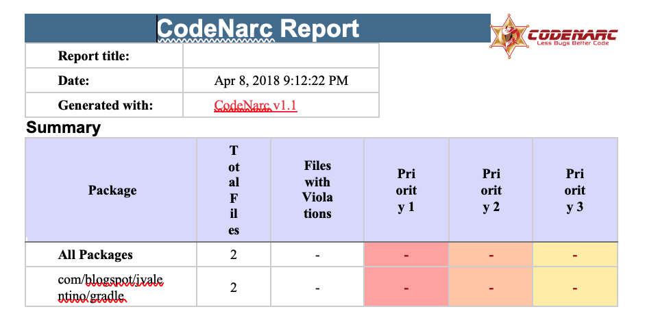
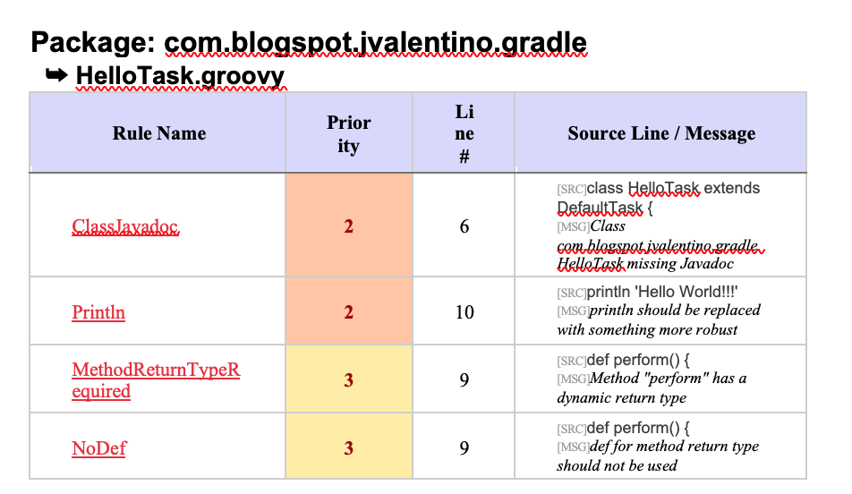

## 3.6 Hello World: Codenarc

CodeNarc analyzes Groovy code for defects, bad practices, inconsistencies, style issues and more (http://codenarc.sourceforge.net/).

 

#### build.gradle

```groovy
// PLUGINS
apply plugin: 'groovy'
apply plugin: 'jacoco'
apply plugin: 'codenarc'

// CODENARC
codenarc {
    toolVersion = "1.1"
}

codenarcMain {
    configFile = file("codenarc/CodeNarcMain.groovy")
    reports {
        html.enabled = true
        xml.enabled = true
    }
}

codenarcTest {
    configFile = file("codenarc/CodeNarcTest.groovy")
}
```

**Line 4: Apply codenarc**

Applies the Codenarc plugin to this build, which adds the codenarc validation during as a part of the **check** task.

 

**Lines 15-17: Codenarc Version**

It is recommended to apply a specific version of Codenarc, as you don’t want another version implicitly changing out from under you at some point in the future. Upgrading will require effort, and is something that should be done explicitly, as rules can change, which will likely require code changes.

 

**Line 20: Main Ruleset**

Codenarc requires a list of rules to be applied. This is where that file can be specified.

 

**Lines 21-24: Reporting**

It is desirable to have both the HTML and XML reports. This is because humans will be interested in the HTML report, while tools such as the Violations Plugin for Jenkins can use the XML output to display Codenarc information as a part of the build pipeline.

 

**Line 28: Test Rules**

Codenarc also requires a ruleset for the test classpath.

 

#### codenarc/CodeNarcMain.groovy

```groovy
ruleset {

    description '''
        A Sample Groovy RuleSet containing all CodeNarc Rules.
        You can use this as a template for your own custom RuleSet.
        Just delete the rules that you don't want to include.
        '''

    // rulesets/basic.xml
    AssertWithinFinallyBlock 
    AssignmentInConditional
    …
```

This is the full Ruleset from the Codenarc 1.1 website. It is 411 lines long.

 

#### codenarc/CodeNarcTest.groovy

```groovy
ruleset {

}
```

The test ruleset has been left blank at this time.

 

#### Running the Check

```bash
hello-world-codenarc$ gradlew check
:codenarcMain
:codenarcTest
:compileJava NO-SOURCE
:compileGroovy UP-TO-DATE
:processResources UP-TO-DATE
:classes UP-TO-DATE
:compileTestJava NO-SOURCE
:compileTestGroovy UP-TO-DATE
:processTestResources NO-SOURCE
:testClasses UP-TO-DATE
:test UP-TO-DATE
:check

BUILD SUCCESSFUL in 14s
```

#### build/reports/codenarc/main.html



The resulting report for the current codebase will show no issues, as generated under the **build/reports** directory.

#### Changing HelloTask to have issues

```groovy
package com.blogspot.jvalentino.gradle

import org.gradle.api.DefaultTask
import org.gradle.api.tasks.TaskAction

class HelloTask extends DefaultTask {

    @TaskAction
    def perform() {
        println 'Hello World!!!'
    }
}
```

The **HelloTask** class was modified, so that there are now Codenarc violations. Specifically, the Javadoc at the class level was removed, the supression of **println** usage was removed, and the method type to changed from **void** to **def**. When the **check** is now run:

```bash
hello-world-codenarc$ gradlew check
:codenarcMain
:codenarcMain FAILED

FAILURE: Build failed with an exception.

* What went wrong:
Execution failed for task ':codenarcMain'.
> CodeNarc rule violations were found. See the report at: file:///Users/jvalentino2/workspaces/gradle-book/hello-world-codenarc/build/reports/codenarc/main.html

* Try:
Run with --stacktrace option to get the stack trace. Run with --info or --debug option to get more log output.

* Get more help at https://help.gradle.org

BUILD FAILED in 17s
```

The build fails due to one or more CodeNarc violations. Do you want the build to fail because of violations? Yes, because if no action is taken for violations, developers generally never get around to fixing them. Then what use is knowing that you have CodeNarc violations that you never intend to fix? It is worth noting that it is much easier to start a project with the rules in place by default, as adding them after-the-fact can result in hudreds if not thousands of issues.

 

#### build/reports/codenarc/main.html (with issues)




